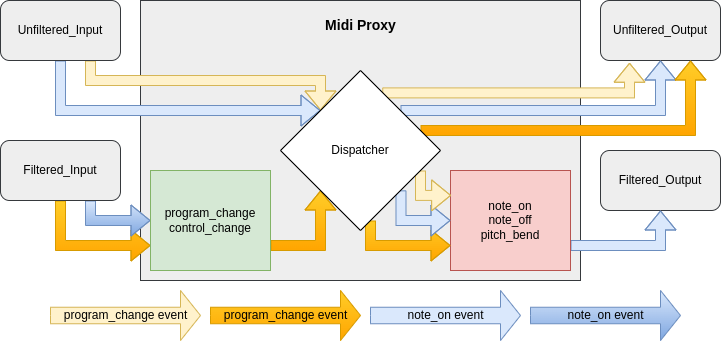

# MidiProxy
MidiProxy is a small tool, written in GO, that takes several types of MIDI messages from one or more input devices, and forwards those to one or more output devices.
Both input and output devices can apply filters to specify which MIDI messages should be routed, and which should be ignored.

## Usage
The proxy reads the "config.yaml" file, located in the same directory as the executable. The config file contains all of the settings for the program.
You will need to specify the names of the input and output devices in the config file. You can find the names of the connected devices by running the program with the `-l` flag.
If you don't specify any message types in the proxy field, the device will send/receive all allowed MIDI types.

## Config

An example of the config file would look like this:

```yaml
---
inputs:
  - name: Unfiltered_Input
  - name: Filtered_Input
    proxy:
      - program_change
      - control_change
outputs:
  - name: Unfiltered_Output
  - name: Filtered_Output
    proxy:
      - note_on
      - note_off
      - pitch_bend
```
The available proxy types are:
 - note_off
 - note_on
 - poly_aftertouch
 - control_change
 - program_change
 - chan_aftertouch
 - pitch_bend

 Information about these messages can be found in the [MIDI Specs](https://www.midi.org/specifications-old/item/table-1-summary-of-midi-message).

## Workings
Since one image speaks louder than a thousand words, this is how the event filtering works:


## Building
In order to build the project, first download or `git clone` it, and then:
```bash
cd midiproxy/src
go mod tidy
go build -o ../midiproxy main.go
```
If you want to compile it on Windows, you'll need to take a few extra steps. You will need to install portmidi first. You can follow [this tutorial](https://schollz.com/blog/portmidi/).
I had the issue that the portmidi library wouldn't compile, and `go build` returned the error: `build constraints exclude all Go files in <path to portmidi src files>`. I was able to fix this by enabling the 
```powershell
$env:CGO_ENABLED=1
```
I also had to install `gcc` in the same method as described in the above tutorial.
Don't forget to add the gcc location to your path file.
